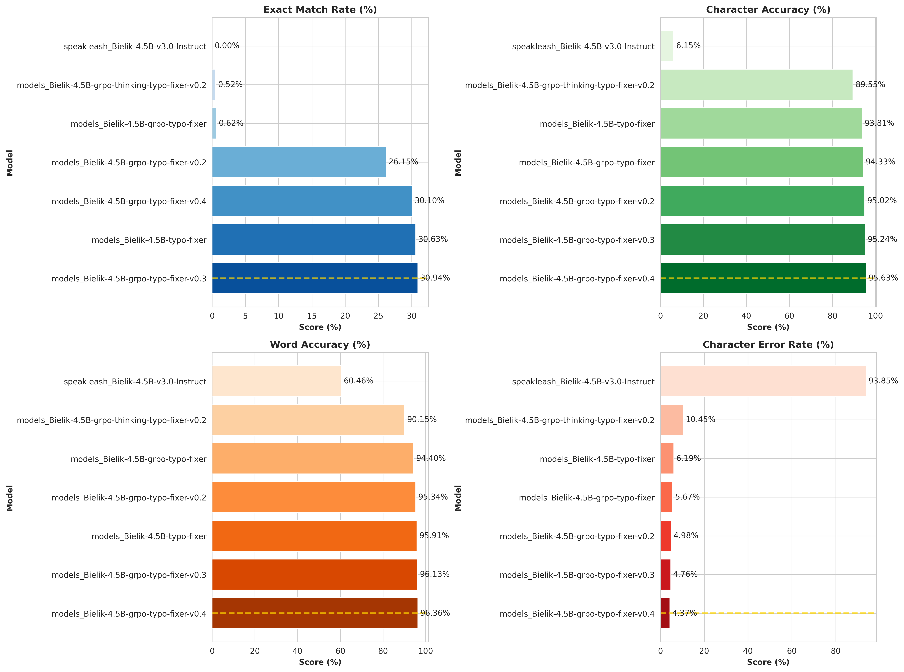
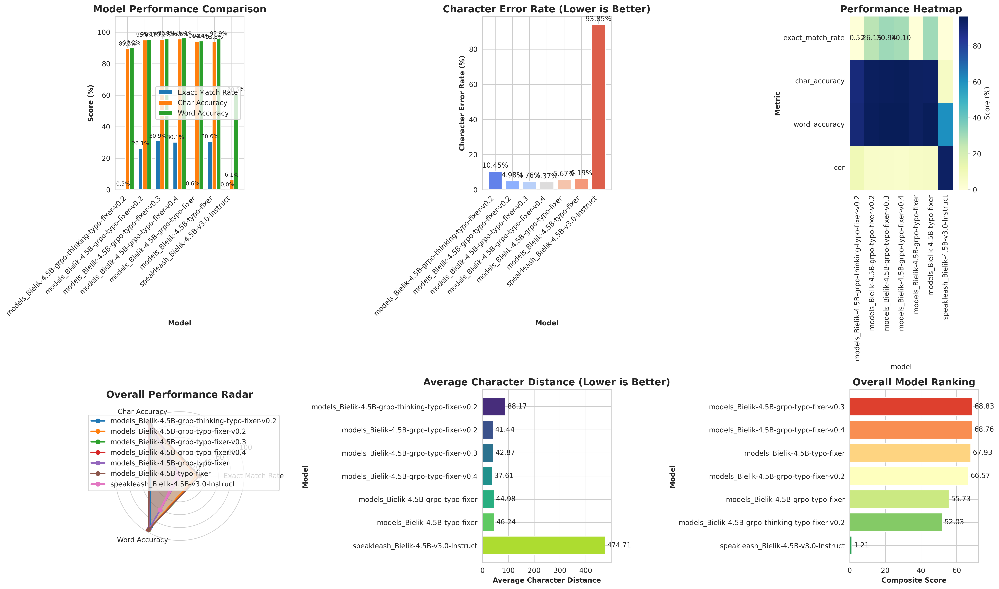

# Bielik Typo Fixer - Fine-tuning Project

Fine-tuning experiments for Polish language typo correction using Bielik models with various training approaches (SFT, GRPO, pre-thinking).

## Evaluation Results

### Performance Metrics

### Visualizations

